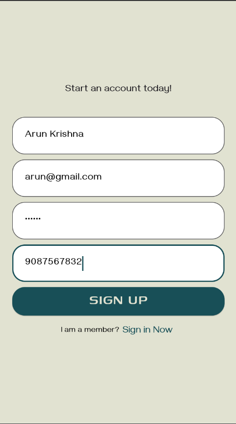

# Nutrilab

NUTRILAB is a food delivery app dedicated to holistic lifestyle choices and healthy eating habits. 
This is a fun self-initiated project which aided me in continued learning and hands on knowledge.


## Table of contents

- [Features](#features)
- [Screenshot](#screenshot)
- [My process](#my-process)
  - [Built with](#built-with)
  - [What I learned](#what-i-learned)
  - [Continued development](#continued-development)
- [Author](#author)
- [Acknowledgments](#acknowledgments)

## Features

### Profile

Users can create a profile using the register option and add details such as name, email, mobile and set a password. Registered users can login using their email and passowrd. There is also an option to reset password via email. Users can edit their personal information, add/change address and logout in the profile page.

### Menu
Once logged in, users can view the menu page with various food items displayed along with their image, name, price as well as an option to save the item. User can search for items or filter them by categories (breakfast, lunch, dinner, snack, drinks).

### Saved items
User can click on the heart icon to save or unsave an item from their saved items.

### Food details page
If user clicks on an item, they can view more details like ingredients and calories and add/remove item into their cart.

### Your cart
User can view their cart where they can add more items, remove an item or save it for later. They can also see the total amount and proceed to checkout.


## Screenshot
### Register Page
    
### Login page
    
### Menu page
    
### Filtration feature
    
### Search and filtration
    
### No items in search
    
### Details page
    
### Saved items page
    
### Cart page
    
### Checkout page
    
### Profile page
    
### Edit page
    

## My process

### Built with

- Flutter
- Firebase Authentication
- Firestore Database
- Bloc

### What I learned

I learnt how to use various components of material package in Flutter to build a user-friendly interface. I also learnt how to integrate firebase into my flutter project, how efficient and easier a project becomes with the use of a database. I first used stateful state management but started learning about Bloc and am trying to migrate a few components to Bloc state management.

A wrapper was used to check if user is logged in or not, so that user does not have to login each time they open the app.
```dart
StreamBuilder(
  stream: FirebaseAuth.instance.authStateChanges(),
  builder: (context, snapshot) {
    if (snapshot.connectionState == ConnectionState.waiting) {
      return Center(child: CircularProgressIndicator());
    } else if (snapshot.hasError){
      return Center(child: Text("Error"),);
    } else {
      if (snapshot.data == null){     //user not logged in
        return GoToLoginPage();
      }
      else{
        return BottomNav();
      }
    }
  },
)
```

I was really proud of learning how to implement a grid view builder of custom widgets that use information from the firebase database.
```dart
GridView.builder(
  gridDelegate: SliverGridDelegateWithFixedCrossAxisCount(
    crossAxisCount: 2,
    childAspectRatio: 0.75, 
    mainAxisSpacing: 10.0,
    crossAxisSpacing: 10.0,
  ),
  itemCount: data.size,
  itemBuilder: (
    context,
    index,
  ) {
    return MenuItemWidget(
      name: data.docs[index]['Name'],
      des: data.docs[index]['Description'],
      img: data.docs[index]['Image'],
      ingr: data.docs[index]['Ingr'],
      type: data.docs[index]['Type'],
      cal: data.docs[index]['Calories'],
      price: data.docs[index]['Price'],
      itemId: data.docs[index].id,
    );
  },
);  
```

Using blocs were challenging and gave me insightful information on how logic can be implemented separate from presentation layer.


### Continued development

Using stateful state management, rebuilding pages was difficult and the UI doesn't look pleasing. So I am trying to migrate to bloc. However it is challenging to separate logic from the presentation layer. I created a food model to store all the information related to each item but it hasn't been integrated with the frontend.

```dart
class MenuBloc extends Bloc<MenuEvent, MenuState> {
  final String userId;

  MenuBloc(this.userId) : super(MenuInitial()) {
    on<LoadMenuItems>(_onLoadMenuItems);
  }
}
```
I am yet to learn how to efficiently implement blocs and avoid different blocs from being interconnected.


## Author

- Github - [@snehaa011](https://github.com/snehaa011)
- LinkedIn - [Sneha Biju Kurup](https://www.linkedin.com/in/sneha-biju-kurup-994a0b291/)

## Acknowledgments

I would like to thank my friends for encouraging and giving constant feedbacks on my project. I express my sincere gratitude to my colleagues in Talabat for guiding me and introducing me to professional practices which helped me improve my project. I was able to reinforce my learning and definitely, learn much more.

